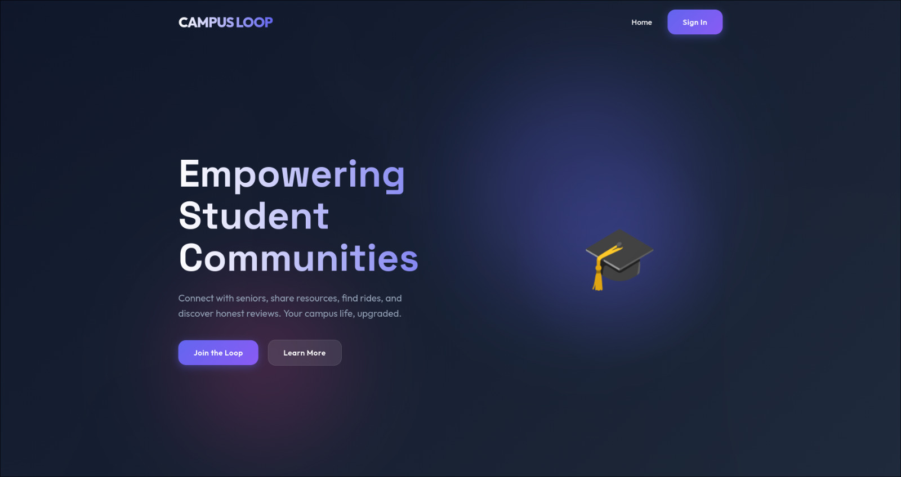
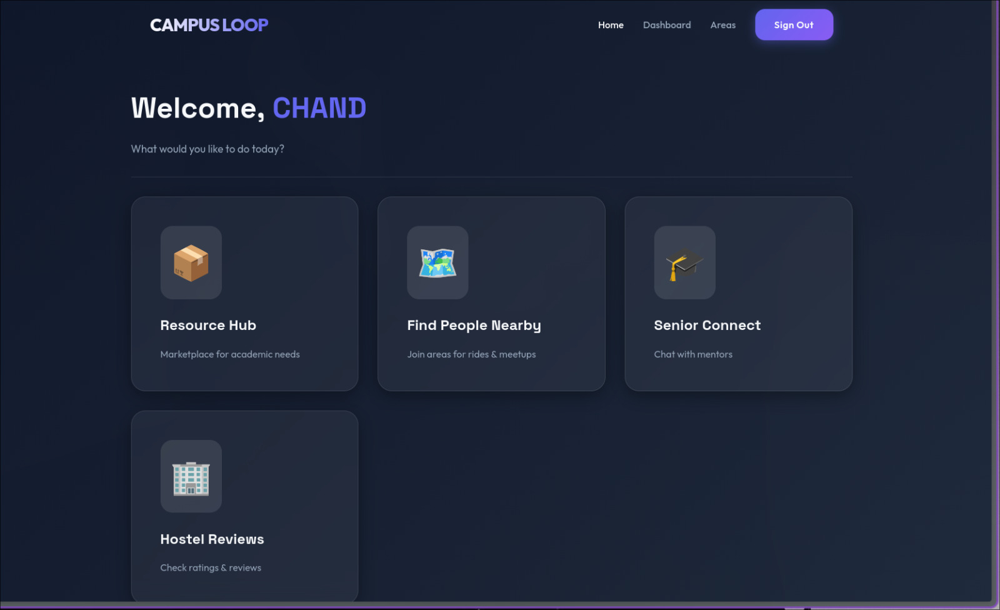
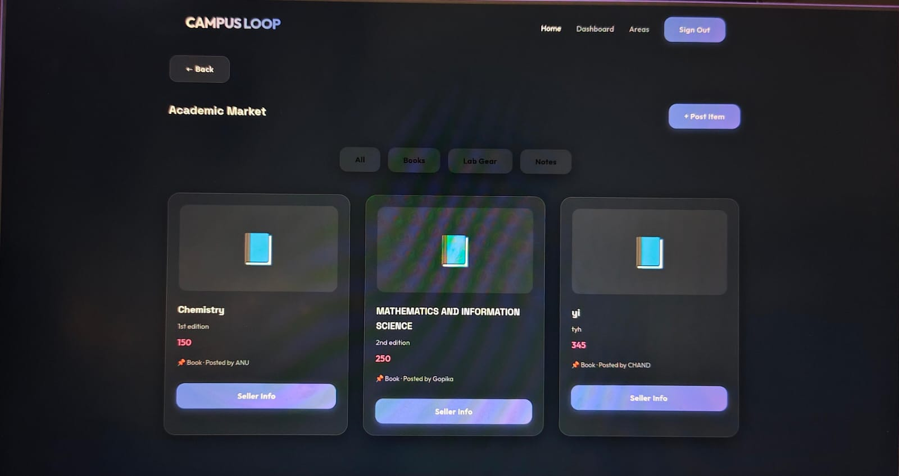

<p align="center">
  
</p>

 Campusloop 🎯

## Basic Details

### Team Name: Infix

### Team Members
- Member 1: CHANDANADAS M - NSS College of engineering
- Member 2: ABINA B ANI - NSS College of engineering


### Project Description
Campus Loop is a creative, interactive student community platform designed to enhance campus life by connecting students, sharing resources, and building local networks within and around educational institutions.
The platform acts as a centralized digital ecosystem where students can access academic support, connect with seniors, review hostels, and find people nearby in their locality for collaboration or ride sharing.

### The Problem statement
Students in educational institutions often lack a centralized digital platform that integrates academic resources, peer mentorship, hostel information, and locality-based networking. Important updates and study materials are usually shared through scattered and informal channels, making access inconsistent and inefficient.
New students face difficulties in connecting with seniors for guidance, finding reliable hostel reviews, and identifying peers living in the same area for collaboration or ride sharing. The absence of a structured, unified system results in limited student engagement, reduced transparency, and missed opportunities for academic and social collaboration.
Therefore, there is a need for an interactive and integrated campus platform that streamlines communication, enhances peer connectivity, and fosters a stronger student community ecosystem.
### The Solution
Campus Loop solves these challenges by providing a centralized, student-driven digital platform that integrates academic support, mentorship access, hostel transparency, and locality-based networking into one structured ecosystem.
The platform offers an Academic Resource Hub for organized study materials, a Senior Connect module for structured peer mentorship, a Hostel Reviews section for transparent accommodation insights, and a Find People Nearby feature to enable area-based student circles and collaboration.
By bringing these services together in a single interactive dashboard, Campus Loop reduces information gaps, improves peer engagement, and strengthens campus connectivity in a simple and accessible way.

---

## Technical Details

### Technologies/Components Used

**For Software:**
- Languages used: HTML5,CSS3,JavaScript(ES6)
- Frameworks used: Node.js,Express.js
- Libraries used: Bootstrap,MongoDB
- Tools used: VS Code, Git and GitHub 

---

## Features

List the key features of your project:
- 1. Centralized Student Dashboard
An interactive and user-friendly dashboard that integrates all core campus services into a single platform for easy access and navigation.
2. Academic Resource Hub
A structured space where students can access study materials, academic updates, and shared learning resources in an organized manner.
3. Senior Connect (Peer Mentorship System)
A dedicated module that enables students to connect with seniors for academic guidance, career advice, and mentorship support.
4. Locality & Accommodation Support
Includes transparent hostel reviews and a “Find People Nearby” feature that allows students to form area-based circles for networking and ride-sharing opportunities.
---

## Implementation

### For Software:

#### Installation
```bash
git clone https://github.com/your-username/campus-loop.git
cd campus-loop
npm install

#### Run
```bash
[Run commands - e.g., npm start, python app.py]
```


### For Software:

#### Screenshots (Add at least 3)

Screenshot1
<p>

</p>
The homepage of CampusLoop, introducing the platform and its key purpose of connecting students through a unified campus community

<p>

</p>
CampusLoop Dashboard
The main dashboard displaying the core modules of CampusLoop, including Resource Hub, Find People Nearby, Senior Connect, and Hostel Reviews.

<p>

</p>
Academic Resource Hub
The Resource Hub module where students can browse, share, and access academic materials such as books, notes, and lab resources.

#### Diagrams

System Architecture:
CampusLoop follows a layered architecture consisting of a Frontend, Backend, and Database. The frontend, developed using HTML, CSS, and JavaScript, provides the user interface and communicates with the backend through Fetch API requests. The backend, built with Node.js and Express.js, processes user requests and manages the core modules, including User Management, Area Management, and the Academic Resource Hub. These modules handle authentication, student networking, ride preferences, and resource sharing functionalities. All application data is stored and managed in MongoDB, ensuring efficient and secure data handling. This architecture enables seamless communication between components while maintaining scalability and modularity.
</p>

**Application Workflow:**
<p>
CampusLoop begins with user authentication through the Login or Register page. Once authenticated, users are directed to the main dashboard, where they can access different platform modules. Students can browse and share academic materials through the Resource Hub, connect with nearby peers using Find People Nearby, interact with mentors through Senior Connect, and explore or contribute accommodation feedback via Hostel Reviews. All user actions and module data are processed by the backend and stored in MongoDB, ensuring seamless data management and retrieval across the platform.
</p>
---

---


## License

This project is licensed under the [LICENSE_NAME] License - see the [LICENSE](LICENSE) file for details.

**Common License Options:**
- MIT License (Permissive, widely used)
- Apache 2.0 (Permissive with patent grant)
- GPL v3 (Copyleft, requires derivative works to be open source)

---

Made with ❤️ at TinkerHub
